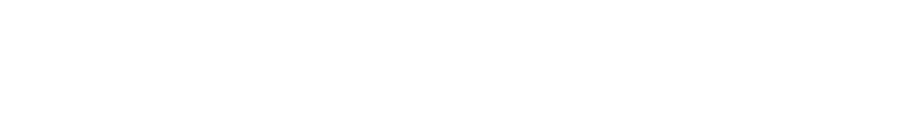

 

 

# CineSneak

[Sitio Web](https://cinesneak.vercel.app/) 🔗🌐

CineSneak 📽️🎬, una app donde puedes visitar un extenso catálogo de series y películas. Pero, no es solo otra aplicación de entretenimiento. 
¡Es mucho más que eso! En CineSneak, tendrás la oportunidad de personalizar tu experiencia de visualización al máximo.

¿Quieres añadir tus series favoritas? ¡Puedes hacerlo! ✔️  
¿Quieres llevar un registro de las películas que ya has visto? ¡También puedes hacerlo! ✔️

## Sobre el proyecto

🏗️ 🚧 👷🏻‍♀️ Actualmente, el proyecto está en desarrollo; a continuación se detallan los avances y las funcionalidades pendientes:

✅ Visualización de películas en cartelera, tendencias semanales, más populares y top 10 más votadas.  
✅ Visualización de series en tendencia esta semana, más populares y top 10 mejor valoradas.  
✅ Información detallada tanto de películas como series (Fecha de emisión, duración, dónde ver...).  
✅ Minireproductor, permitiéndote seguir navegando por la web.  
✅ Acceso y paginación para todo el catálogo de series y películas.  
⬜ Buscador avanzado por nombre, categoría, series o películas.  
⬜ Registro de usuario para acceder a funciones adicionales.  
⬜ Añadir contenido a tus listas de favoritos y ya visto (Usuarios registrados).  
⬜ Test para las principales funcionalidades de la web.  
⬜ Diseño responsive para múltiples dispositivos.  
⬜ Accesibilidad y SEO.

## Tecnologías utilizadas

